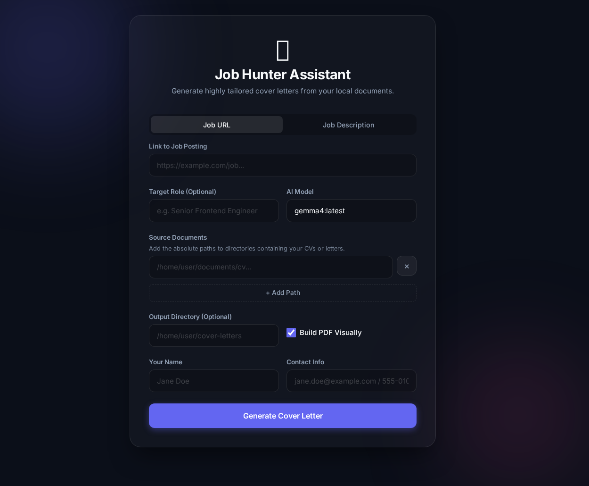

# Job Hunter Assistant MVP

This project generates a tailored cover letter from a job URL using your local source documents.

## What it does

- **Frontend GUI:** A sleek dark-mode glassmorphism web interface built with Vanilla JavaScript and FastAPI.
- **Output Mode Switch:** Choose PDF export to generate a PDF that opens in a new browser tab with download controls, or leave it unchecked to get the cover letter text directly in the page.
- **RAG for CVs/Letters**: Parses arbitrary formats (Markdown, PDF, etc.) from given directories to find the most relevant achievements that match the job description.
- **Context-Aware Drafting**: Generates professional cover letters uniquely addressing specific job requirements and automatically placing context metadata.
- **Multi-Source Ingestion**: Process straight from job posting URLs or feed it raw pasted text.



## Run

```bash
python3 -m src.job_hunter_assistant.cli "https://example.com/job-posting" --role "Software Engineer"
```

Use `--save` to save without prompt:

```bash
python3 -m src.job_hunter_assistant.cli "https://example.com/job-posting" --save
```

## Run In Browser (Frontend UI)

Start the FastAPI app and open the local frontend:

```bash
source .venv/bin/activate
python app.py
```

Then open:

```text
http://127.0.0.1:8000
```

Alternative server command:

```bash
source .venv/bin/activate
uvicorn app:app --reload
```

In the browser UI:

- Check **Export as PDF** to generate a PDF file in `output/cover-letters/` and open it in a new browser tab, where you can download it from the PDF viewer.
- Leave **Export as PDF** unchecked to display the generated cover letter text directly in the page, with a copy button for quick reuse.

## PDF Customization

When exporting as PDF, you can control:

- **Style preset** — select in the form:
  - *Modern*: Helvetica font, centered header
  - *Classic*: Times New Roman, left-aligned header

- **Fine-grained template overrides** — copy `config/pdf-template.example.json` to `.local/pdf-template.json` and customize fonts, sizes, margins, spacing, and alignment per section. Only include keys you want to override; the rest inherit from the selected style preset.

  Example — change only the body font size:
  ```json
  { "body": { "size": 12 } }
  ```

  Available sections: `page` (margins, format), `header` (name), `contact`, `date`, `body`.

## Security

This tool is **designed for local use only**. Before deploying or exposing to a network:

- Set the `JH_API_KEY` environment variable to enable API authentication (see [SECURITY.md](./SECURITY.md) for details).
- Do not expose the API to the internet without a reverse proxy and HTTPS.
- See [SECURITY.md](./SECURITY.md) for full security guidance.

## Supported File Formats

The workflow automatically extracts text from:
- **Plain text**: `.md`, `.txt`, `.rst`
- **PDF**: `.pdf` (via pypdf)
- **Microsoft Word**: `.docx` (via python-docx)

All text is aggregated to build your candidate profile.

## Source Config

Create `.local/config.json` with your sources and provider settings:

```json
{
	"sourcesDir": [
		"/path/to/applications",
		"/path/to/cv",
		"https://your-portfolio.example"
	],
	"model": "gemma4:latest",
	"keepAlive": "10m",
	"provider": "ollama",
	"providerConfig": {}
}
```

## LLM Providers

The tool supports three LLM providers for generating cover letters:

### Ollama (default, local)

```json
{
	"provider": "ollama",
	"model": "gemma4:latest",
	"providerConfig": {}
}
```

**Requirements:**
- Ollama running locally (default: `http://localhost:11434`)
- Override with `OLLAMA_BASE_URL` env var if needed
- No API key required

**Supported models:** gemma4, llama2, neural-chat, mistral, etc.

### OpenAI

```json
{
	"provider": "openai",
	"model": "gpt-4-turbo",
	"providerConfig": {}
}
```

**Requirements:**
- `pip install openai>=1.0.0`
- Set `OPENAI_API_KEY` environment variable
- Usage will incur costs per API call

**Supported models:** gpt-4-turbo, gpt-4, gpt-3.5-turbo

### Anthropic

```json
{
	"provider": "anthropic",
	"model": "claude-3-opus-20240229",
	"providerConfig": {}
}
```

**Requirements:**
- `pip install anthropic>=0.10.0`
- Set `ANTHROPIC_API_KEY` environment variable
- Usage will incur costs per API call

**Supported models:** claude-3-opus-*, claude-3-sonnet-*, claude-3-haiku-*

## Install Dependencies

```bash
pip install -r requirements.txt

# For OpenAI support:
pip install openai>=1.0.0

# For Anthropic support:
pip install anthropic>=0.10.0
```
